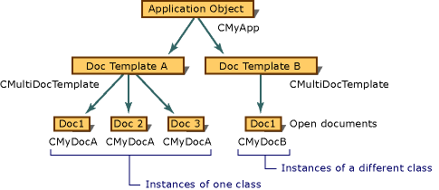

# Document Templates and the Document/View Creation Process

To manage the complex process of creating documents with their associated views and frame windows, the framework uses two document template classes: [CSingleDocTemplate](reference/csingledoctemplate-class.md) for SDI applications and [CMultiDocTemplate](reference/cmultidoctemplate-class.md) for MDI applications. A `CSingleDocTemplate` can create and store one document of one type at a time. A `CMultiDocTemplate` keeps a list of many open documents of one type.

Some applications support multiple document types. For example, an application might support text documents and graphics documents. In such an application, when the user chooses the New command on the File menu, a dialog box shows a list of possible new document types to open. For each supported document type, the application uses a distinct document template object. The following figure illustrates the configuration of an MDI application that supports two document types and shows several open documents.

  
An MDI Application with Two Document Types

Document templates are created and maintained by the application object. One of the key tasks performed during your application's `InitInstance` function is to construct one or more document templates of the appropriate kind. This feature is described in [Document Template Creation](document-template-creation.md). The application object stores a pointer to each document template in its template list and provides an interface for adding document templates.

If you need to support two or more document types, you must add an extra call to [AddDocTemplate](reference/cwinapp-class.md#adddoctemplate) for each document type.

An icon is registered for each document template based on its position in the application's list of document templates. The order of the document templates is determined by the order they are added with calls to `AddDocTemplate`. MFC assumes that the first Icon resource in the application is the application icon, the next Icon resource is the first document icon, and so on.

For example, a document template is the third of three for the application. If there is an Icon resource in the application at index 3, that icon is used for the document template. If not, the icon at index 0 is used as a default.

## See also

[General MFC Topics](general-mfc-topics.md) 
[Document Template Creation](document-template-creation.md) 
[Document/View Creation](document-view-creation.md) 
[Relationships Among MFC Objects](relationships-among-mfc-objects.md) 
[Creating New Documents, Windows, and Views](creating-new-documents-windows-and-views.md)
