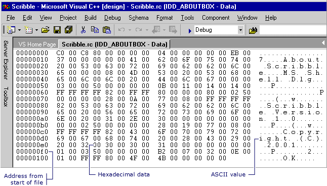

# Binary Editor (C++)

> [!CAUTION]
> Editing resources such as dialog boxes, images, or menus in the **Binary Editor** is dangerous. Incorrect editing could corrupt the resource, making it unreadable in its native editor.

The **Binary Editor** allows you to edit any resource at the binary level in either hexadecimal or ASCII format. You can also use the [Find command](/visualstudio/ide/reference/find-command) to search for either ASCII strings or hexadecimal bytes. Use the **Binary Editor** only when you need to view or make minor changes to custom resources or resource types not supported by the Visual Studio environment. The **Binary Editor** is not available in Express editions.

- To open the **Binary Editor** on a new file, go to menu **File** > **New** > **File**, select the type of file you want to edit, then select the drop arrow next to the **Open** button, and choose **Open With** > **Binary Editor**. The dropdown selection in the New file dialog isn't available in Visual Studio 2019, but is available in Visual Studio 2022.

- To open the **Binary Editor** on an existing file, go to menu **File** > **Open** > **File**, select the file you want to edit, then select the drop arrow next to the **Open** button, and choose **Open With** > **Binary Editor**.

   <br/>
   Binary data for a dialog box displayed in the **Binary Editor**

Only certain ASCII values are represented in the **Binary Editor** (0x20 through 0x7E). Extended characters are displayed as periods in the right panel ASCII value section of the **Binary Editor**. The printable characters are ASCII values 32 through 126.

> [!TIP]
> While using the **Binary Editor**, in many instances you can right-click to display a shortcut menu of resource-specific commands. The commands available depend on what your cursor is pointing to. For example, if you right-click while pointing to the **Binary Editor** with selected hexadecimal values, the shortcut menu shows the **Cut**, **Copy**, and **Paste** commands.

## How To

The **Binary Editor** enables you:

### To open a Windows desktop resource for binary editing

1. In [Resource View](how-to-create-a-resource-script-file.md#create-resources), select the specific resource file you want to edit.

1. Right-click the resource and select **Open Binary Data**.

> [!NOTE]
> If you use the **Resource View** window to open a resource with a format that Visual Studio doesn't recognize, such as RCDATA or a custom resource, the resource is automatically opened in the **Binary Editor**.

### To open a managed resource for binary editing

1. In **Solution Explorer**, select the specific resource file you want to edit.

1. Right-click the resource and select **Open With**.

1. In the **Open With** dialog box, choose **Binary Editor**.

> [!NOTE]
> You can use the [Image Editor](image-editor-for-icons.md) and the **Binary Editor** to work with resource files in managed projects. Any managed resources you want to edit must be linked resources. The Visual Studio resource editors do not support editing embedded resources.

### To edit a resource

If you want to use the **Binary Editor** on a resource already being edited in another editor window, close the other editor window first.

1. Select the byte you want to edit.

   The **Tab** key moves the focus between the hexadecimal and ASCII sections of the **Binary Editor**. You can use the **Page Up** and **Page Down** keys to move through the resource one screen at a time.

1. Type the new value.

   The value changes immediately in both the hexadecimal and ASCII sections and focus shifts to the next value in line.

> [!NOTE]
> The **Binary Editor** accepts changes automatically when you close the editor.

### To find binary data

You can search for either ASCII strings or hexadecimal bytes. For example, to find *Hello*, you can search for either the string *Hello* or its hexadecimal value, *48 65 6C 6C 6F*.

1. Go to menu **Edit** > [Find](/visualstudio/ide/reference/find-command).

1. In the **Find What** box, select a previous search string from the drop-down list or type the data you want to find.

1. Select any of the **Find** options and choose **Find Next**.

### To create a new custom or data resource

You can create a new custom or data resource by placing the resource in a separate file using normal resource script (.rc) file syntax, and then including that file by right-clicking your project in **Solution Explorer** and selecting **Resource Includes**.

1. [Create a .rc file](how-to-create-a-resource-script-file.md) that contains the custom or data resource.

   You can type custom data in a .rc file as null-terminated quoted strings, or as integers in decimal, hexadecimal, or octal format.

1. In **Solution Explorer**, right-click your project's .rc file and select **Resource Includes**.

1. In the **Compile-Time Directives** box, type a `#include` statement that gives the name of the file containing your custom resource, for example:

    ```cpp
    #include mydata.rc
    ```

   Make sure the syntax and spelling of what you type are correct. The contents of the **Compile-Time Directives** box are inserted into the resource script file exactly as you type them.

1. Select **OK** to record your changes.

Another way to create a custom resource is to import an external file as the custom resource, see [How to: Manage Resources](./how-to-copy-resources.md).

> [!NOTE]
> Creating new custom or data resources requires Win32.

## Requirements

None

## See also

[Resource Editors](resource-editors.md)
